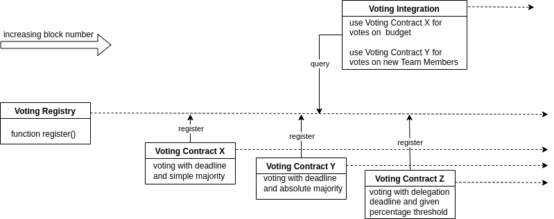

# Voting Registry

## Overview

It would be great to have a simple registry where all possible voting interfaces and varieties can be registered and queried. This would solve the problem of needing to deploy the n-th version of a simple majority voting dapp, or token-wheighted voting dapp or first-pass-the-post dapp or delegated voting dapp or aggregated voting dapp or what not. Every type of customized voting functionality could be implemented, too. The user contract simply implements a simple interface and can just choose which voting dapp it uses for its votes. It would hook up to the registry and receive the voting app that meets the needs. The voting app needs to have three functions implemented, namely `start`, `vote` and `implement`. The first one, i.e. `start`, receives the `votingParameters` in *byte*-form and, depending on the requirements, also the implementation parameters (`selector` in *bytes4* and `functionParameters` in *bytes*). The second one, i.e. `vote`, handles the logic of the voting that depends on the votingParameters passed in the `start`-function. The last one, namely `implement`, handles the action taken when the conditions for the vote are met. Optionally each voting app may also implement all sorts of other functions and auxilliary functions.

## Ingredients

The whole setup consists of 

    1. A voting registry
    2. Voting Contracts
    3. Voting Integrations (Implementers)




## Developer

The first time you have to run:
```sh
git submodule update --init --recursive
```

Every other time it suffices to run:
```sh
git submodule update --recursive --remote
```

## Some useful Hardhat commands
Try running some of the following tasks:

```shell
npx hardhat accounts
npx hardhat compile
npx hardhat clean
npx hardhat test
npx hardhat node
npx hardhat help
REPORT_GAS=true npx hardhat test
npx hardhat coverage
npx hardhat run scripts/deploy.ts
TS_NODE_FILES=true npx ts-node scripts/deploy.ts
npx eslint '**/*.{js,ts}'
npx eslint '**/*.{js,ts}' --fix
npx prettier '**/*.{json,sol,md}' --check
npx prettier '**/*.{json,sol,md}' --write
npx solhint 'contracts/**/*.sol'
npx solhint 'contracts/**/*.sol' --fix
```
